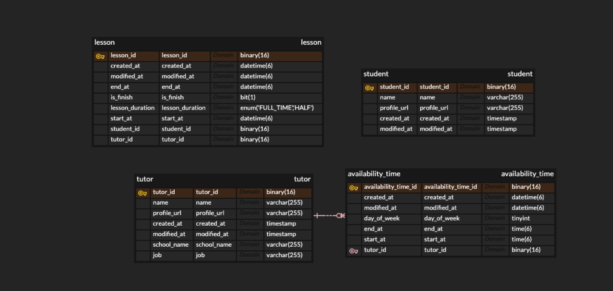

# 링글 - 수강 신청 API 과제

----

### ⚒️ 사용 라이브러리


- `Spring Boot 3.4.4`, `JDK 21`, `QueryDSL`, `MapStruct`, `MySQL`
---

### 💻 실행 방법

**(0) MySQL Workbench 스키마 생성**

```
MySQL Workbench에 사용할 스키마 생성 ex)ringle
```

**(1) 루트 디렉토리 .env 파일 생성 및 설정**

```
DB_URL=jdbc:mysql://localhost:3306/{스키마이름}?serverTimezone=Asia/Seoul
DB_DOCKER_URL=jdbc:mysql://mysql-db:3306/${스키마이름}?serverTimezone=Asia/Seoul
DB_SCHEMA_NAME={스키마이름}
DB_USER_NAME={MYSQL이름}
DB_PASSWORD={MYSQL 비밀번호}
SPRING_PROFILES_ACTIVE=docker
```
**(2) application.yml 설정**
```
spring:
  config:
    import: "optional:file:.env[.properties]"
  datasource:
    initialization-mode: create
    driver-class-name: com.mysql.cj.jdbc.Driver
    url: ${DB_URL}
    username: ${DB_USER_NAME}
    password: ${DB_PASSWORD}

  jpa:
    hibernate:
      ddl-auto: update
      database-platform: org.hibernate.dialect.MySQLDialect
      defer-datasource-initialization: true
    properties:
      hibernate:
        dialect: org.hibernate.dialect.MySQLDialect
        show_sql: false
        format_sql: false

  sql:
    init:
      mode: always
```

**(3) jar 생성**
```
./gradlew clean build
```

**(4) docker-compose 실행**
```
docker-compose up --build
```

---
### 🔍 도메인 설계

**ERD**  



**tutor**
- 선생님(수업을 제공하는 사람) 사용자를 나타내는 테이블입니다.
- 수업 가능 시간 테이블(AvailabilityTime) 과 1:N 매핑

**availability_time**
- 선생님의 수업 가능 시간을 나타내는 테이블입니다.
- 수업 최소 단위(30분)만큼 나눠져 저장됩니다. 즉, 화요일 06:00 ~ 07:00 을 수업 가능 시간으로  
   신청하면 06:00 ~ 06:30, 06:00 ~ 07:00 총 두개의 데이터가 생성됩니다.

**lesson**
- 수업 신청 정보를 저장하는 테이블입니다.
- Tutor 와 Student 와의 연관관계를 PK 값으로만 가지며 매핑했습니다. (테스트와 확장성에 용이)

**student**
- 학생(수업을 신청하는 사람) 사용자를 나타내는 테이블 입니다.

---

### 🔍 기능 구현 목록

**튜터 기능**

- [x] 튜터는 수업 가능한 시간대를 생성한다.
  - [x] 수업 가능한 시간은 시작시간, 종료 시간, 요일(월~일)을 이용해 생성한다.
  - [x] 중복된 시간이 있는지를 검증한다.
- [x] 튜터는 수업 가능한 시간대를 삭제한다.

**학생 기능**

- [x] 학생은 기간, 수업 길이로 현재 수업 가능한 시간대를 조회한다.
  - [x] 현재 수업 가능한 시간은 30분 단위로 나눠 응답하고, 해당 범위내에 예약된 내역이 없어야 한다.
- [x] 학생은 시간대, 수업 길이로 수업 가능한 튜터를 조회한다.
  - [x] 선택한 시간대를 기준으로 수업 길이만큼 빼고, 더한 시간에 대해 신청할 수 있는지 여부를 함께 반환한다.  
     ex) 07:00 선택, 수업 길이 30분일 경우 06:30, 07:00, 07:30 각각에 대한 신청 여부를 반환한다.
- [x] 시간대, 수업 길이, 튜터를 이용해 새로운 수업을 신청한다.
  - [x] 이미 해당 시간에 신청한 내역이 있는지를 검증한다. 
- [x] 신청한 수업을 조회한다.
  - [x] 신청한 수업은 최신순으로 정렬한다.


### 향후 계획 

---

- [ ] 현재 인증/인가를 사용하고 있지 않아 DTO 또는 URL 에 사용자 PK 를 주고 받는 기능이 존재하기 때문에,   
    JWT를 통해 보안 취약점 개선
- [ ] JUnit5를 이용한 단일/통합 테스트 작성
- [ ] 부족한 검증기능들 추가 구현
- [ ] 수업 가능 시간 테이블(availability_time) 관련 쿼리 튜닝 
  
